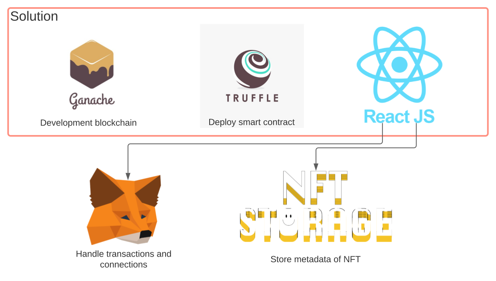

# NFT
Programming about NFT

## [x] V1

### [x] Solidity

Working on storing NFT datas: owner, URI, identifier, etc.

### [x] Web

Working on connecting to metamask and https://nft.storage/
Development of a user interface to facilitate file uploading

## [] V2

### [] Solidity

Enable buying/selling NFT on contract

### [] Web

User interface for buying/selling NFT

## How to use

Before starting, please create an account on [NFT Storage](https://nft.storage/) in order to store all the required metadata files.
Here is the solution diagram: 

1. Run `ganache-cli -i 2022̀` to execute a local blockchain. Don't forget to import some private keys to MetaMask;

2. In solidity/ directory, run `truffle migrate` in order to deploy the NFT smart contract in the blockchain;

3. Move build/contracts/NFT.json into web/src/contracts/ directory;

4. In web/ directory, run `npm install` then `npm start` to execute the web server;

You are now able to use the web site and upload image. Resulting metadatas will be stored in nft.storage and its URI in the local blockchain.
In order to display all NFTs, web site calls all token ids stored in the blockchain in order to load all metadata and, hence, all image URL.
